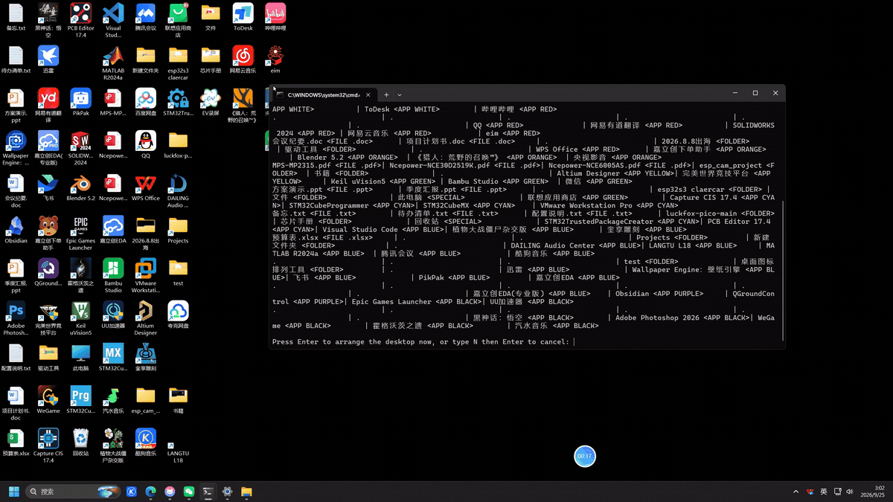

# 桌面图标排列工具 · Desktop Icon Arranger

一个绿色免安装的 Windows 小工具：**按图标自身的颜色自动分类**，把桌面排成四个区域；
并且允许你手工微调后，把结果「固化成自己的布局」，以后一键回放。

> A portable Windows toolkit that classifies desktop icons **by their dominant colour**
> and lays them out in four zones — loose files by type, folders, This PC / Recycle Bin,
> and applications as a colour band. Double-click to run: no installer, no admin rights,
> no network access, no dependencies beyond what ships with Windows.



*双击运行 → 打印排布方案 → 回车 → 图标按颜色飞入四个区域（GIF 为 1.5 倍速）*

---

## 特性

- 🎨 **按主色分类** —— 取图标真实位图，用 HSV 饱和度加权直方图求主色相，再用明度阈值区分白系 / 黑系
- 🗂️ **四区布局** —— 临时文件（按扩展名分行）· 文件夹（居中块）· 此电脑+回收站（单列）· 应用软件（颜色带）
- 🌈 **颜色带顺序** —— 白 → 红橙黄绿青蓝紫 → 黑，逐行从左到右填充，列数自动取「最少够用」
- ✍️ **人机协作** —— 自动排 → 手工微调 → 保存为「我的布局」→ 一键回放。算法只是起点，审美在你手里
- 🛠️ **分类覆盖表** —— 用一个文本文件覆盖算法的判断（`图标名 = 颜色系 / 区域`），写错也不会崩
- 🧩 **零依赖** —— 只用 Windows 自带的 PowerShell 5.1 与 .NET Framework，不联网、不装东西
- 💾 **绿色可拷贝** —— 整个文件夹拷到任何 Win10/11 机器都能直接跑，分辨率 / 缩放 / 任务栏高度自动适应

## 快速开始

1. 下载或克隆本仓库
2. 桌面右键 → 查看 → **关闭「自动排列图标」**（必须）
3. 双击 `1-排列桌面.cmd`，先看一遍方案，回车确认

| 入口 | 作用 |
| --- | --- |
| `1-排列桌面.cmd` | 按规则自动排列（先打印方案，回车确认，排完自动校验） |
| `2-保存我的布局.cmd` | 把当前桌面存成你自己的方案 `snapshots/my-<电脑名>.json` |
| `3-应用我的布局.cmd` | 一键回到你保存的那份布局 |
| `4-撤销上次排列.cmd` | 回到上一次排列之前（或本机最初的布局） |

> 完整中文说明（含微调须知、跨电脑步骤、参数含义）见 [`使用说明.txt`](使用说明.txt)

## 工作原理

1. **找到图标容器**
   桌面图标住在 explorer.exe 的标准列表控件里，窗口链是
   `Progman`（或某个 `WorkerW`）→ `SHELLDLL_DefView` → `SysListView32`。

2. **跨进程读取**
   `OpenProcess` 拿到 explorer 句柄，`VirtualAllocEx` 在对方进程里申请一块「信箱」；
   用 `LVM_GETITEMTEXTW` 读图标名（需要把 `LVITEM` 结构写进对方内存、`pszText` 指向同一块内存，
   再 `ReadProcessMemory` 把 UTF-16 文本读回来），`LVM_GETITEMPOSITION` 读坐标，
   `LVM_GETITEMSPACING` 读网格大小。
   开头会调用 `SetProcessDPIAware()` —— 否则在 125% 缩放下 2560×1440 会被 DPI 虚拟化成 2048×1152，列数就算错了。

3. **取颜色**
   `SHGetFileInfo(SHGFI_ICON | SHGFI_LARGEICON)` 拿到图标真实显示的位图，
   逐像素转 HSV：饱和度 ≥ 0.25 且明度 ≥ 0.20 的像素按饱和度加权投票进 36 格色相直方图，
   取峰值附近 ±35° 做环形加权平均得到主色相；同时统计「彩度占比」和「平均明度」。

4. **分类**
   明度 < 0.40 → 黑系；彩度 < 0.15 → 灰白系（亮→白，暗→黑）；明度 ≥ 0.80 → 白系；
   其余按色相分段：红(≥330/<15) 橙(15–45) 黄(45–70) 绿(70–160) 青(160–200) 蓝(200–255) 紫(255–330)。
   阈值都在 `Arrange-Desktop.ps1` 顶部 settings 一节，可直接改。

5. **落位（这里有个坑）**
   写回坐标用 `LVM_SETITEMPOSITION`。但桌面列表控件是 `LVS_OWNERDATA`（虚拟列表），
   而且 explorer 的行为是：**把图标移动到已被占用的格子，会把原占用者挤开并连锁扩散** ——
   所以"逐个设到目标格"会把整个桌面打乱。本项目的做法是三阶段：

   ```
   ① 暂存：把所有图标先搬到空闲列，让所有目标格变成空的
   ② 落位：再逐个填进目标格（此时不会触发任何挤开）
   ③ 校验：重新读取全桌名称+坐标与计划比对，有偏差就修复，直到 0 偏差
   ```

   最后打印的 `OK - all N icons are in their planned zone slot.` 是真读回桌面验证过的结果。

## 与现有项目的区别

「读写图标坐标 / 保存还原布局 / 网格排列」这一层已经有成熟开源实现，例如
[desktop-icon-mcp](https://github.com/ei-grad/desktop-icon-mcp)（MIT，MCP server）、
[desktop-icon-backup-manager](https://github.com/mapi68/desktop-icon-backup-manager)、
[Positioner](https://github.com/s0d3s/Positioner)、
[Sylva](https://github.com/Theophania-G/sylva)（Rust，桌面栅栏）。

本项目额外做的是：

- **按图标自身主色分类**（而不是按文件名、类型或人工分组）
- **规则化分区**：文件按类型分行 / 文件夹居中块 / 系统图标单列 / 应用区颜色带 / 自动最少列数 / 区域防撞
- **分类覆盖表**：让个人审美覆盖算法判断
- **人机协作闭环**：自动排 → 手工微调 → 固化为「我的布局」→ 一键回放
- **处理「移动到已占用格子会连锁挤开」这个坑**的暂存—落位—校验三段式

## 环境要求

- Windows 10 / 11
- Windows PowerShell 5.1 与 .NET Framework 4.x（系统自带，无需安装）
- explorer.exe 在**当前登录用户**的桌面会话中运行
- 桌面已关闭「自动排列图标」

## 已知限制

- 只处理主显示器；多显示器未验证
- 图标数量多到「应用区列数会撞上文件夹区」时，脚本会直接报错退出，不会乱排
- 需要读写 explorer 进程内存，首次运行可能被 SmartScreen 或杀毒软件拦一次，允许即可；
  它不修改任何文件、不改系统设置
- 快照 `snapshots/` 是本机私有状态，已在 `.gitignore` 中排除

## 许可

[MIT](LICENSE)
